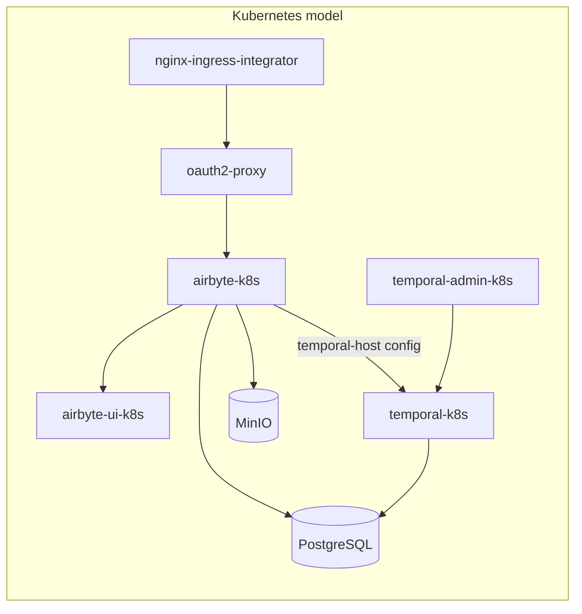

(explanation-airbyte-architecture)=

# Architecture

This page explains the components of a Charmed Airbyte deployment, how they fit together, and the design decisions behind the charm.

## The Airbyte workloads

The `airbyte-k8s` charm manages a single Kubernetes pod that runs Airbyte's services across several containers:

- **airbyte-server** - the core application server. It exposes the Airbyte API and backs the UI.
- **airbyte-workers** and **airbyte-workload-launcher** - execute synchronization jobs, launching and supervising the pods that run each connector.
- **airbyte-workload-api-server** - the API that brokers work between the server and the workers.
- **airbyte-bootloader** - runs once on startup to apply database migrations and initialize the deployment before the other services start.
- **airbyte-cron**, **airbyte-pod-sweeper**, and **airbyte-connector-builder-server** - supporting services that handle scheduled housekeeping, clean up completed job pods, and back the low-code connector builder respectively.

## The backing services

Airbyte keeps no durable state of its own; everything lives in three backing services, each provided by its own charm:

- **PostgreSQL** is the metadata store and the source of truth for connections, jobs, and configuration. The charm reaches it over the standard `postgresql_client` relation.
- **Temporal** is the orchestration engine. It executes sync workflows, manages retries for failed operations, and coordinates the scheduling of long-running pipelines. The `temporal-admin-k8s` charm provides namespace administration and workflow debugging for it, and Temporal itself relates to PostgreSQL for its default and visibility stores.
- **Object storage** (MinIO or an S3-compatible backend) holds job logs, state, and artifacts generated during synchronization.

## Why Temporal is reached by configuration, not a relation

Airbyte connects to Temporal through the `temporal-host` configuration option (default `temporal-k8s:7233`) rather than a Juju relation. This keeps the workflow backend interchangeable: the same charm can point at a Temporal deployed in the model, one shared across models, or an external Temporal service, without changing the relation topology. Temporal's own dependencies - PostgreSQL and the admin charm - are wired with relations as usual.

## Authentication happens at the edge

Airbyte does not authenticate users itself. Instead, the `oauth2-proxy-k8s` charm sits in front of it as a reverse proxy and enforces authentication through an OAuth provider such as Google. Both Airbyte and OAuth2 Proxy are exposed through a single `nginx-ingress-integrator` instance, which handles HTTP routing, performs TLS termination when a TLS secret is configured, enforces source-range allowlists, and manages timeouts for long-running requests. Airbyte exposes only the standard `ingress` interface, so any compatible ingress provider - Nginx Ingress Integrator or Traefik - can serve it.

## The Airbyte UI

The charm provides the `airbyte-server` relation (`airbyte-server` interface), which delivers the Airbyte server's status to a related UI application such as `airbyte-ui-k8s`. The UI provides connector configuration and monitoring, and is reached through the same ingress path as the server.
