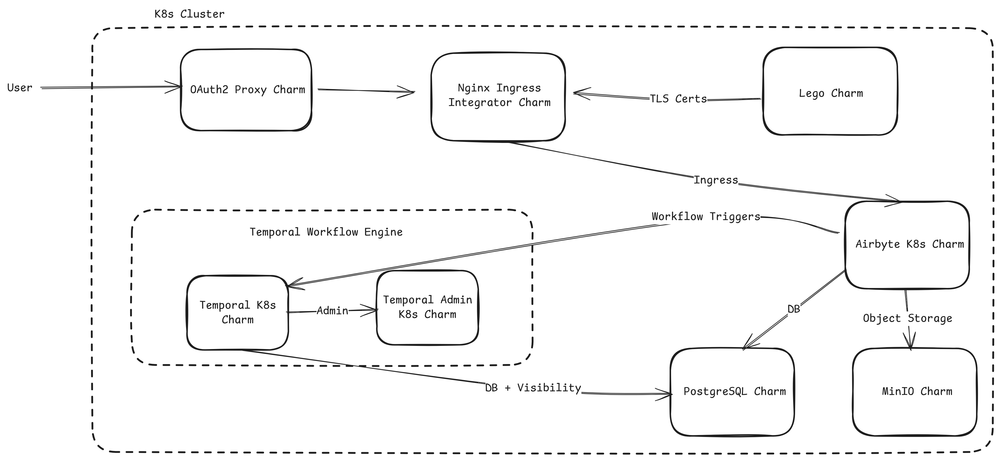

(explanation-airbyte-architecture)=

# Architecture

The Charmed Airbyte ecosystem consists of a number of charmed operators related together. The diagram below shows a high-level illustration of the charms and how they communicate.

## Airbyte

The `airbyte-k8s` charm is the core component that runs the server, scheduler, and API. It uses MinIO as its object storage backend and relies on a PostgreSQL database for persistent data. The charm integrates with OAuth2 Proxy to provide authentication, stores blobs, logs, and state in MinIO, and exposes its services through the standard `ingress` interface, which can be served by any compatible ingress provider such as the Nginx Ingress Integrator or Traefik.

## OAuth2 Proxy

The OAuth2 Proxy charm protects Airbyte by providing authentication through OAuth providers such as Google OAuth, GitHub OAuth, or other SSO solutions. It acts as a reverse proxy in front of Airbyte and is exposed through the same Nginx Ingress Integrator that serves Airbyte itself.

## Nginx Ingress Integrator

A single instance of the Nginx Ingress Integrator handles traffic for both Airbyte and OAuth2 Proxy. This ingress controller manages HTTP routing, performs TLS termination when a TLS secret is configured, enforces source-range allowlists, and handles timeout configuration for long-running requests.

## MinIO

MinIO serves as the object storage backend for Airbyte, providing a scalable solution for storing state information, large log files, and job artifacts generated during data synchronization operations.

## Temporal

The `temporal-k8s` charm is the orchestration engine that powers Airbyte's workflow execution. It handles job execution, manages retries for failed operations, coordinates the scheduling of synchronization tasks, and orchestrates long-running sync pipelines to ensure reliable data movement.

Airbyte reaches Temporal through the `temporal-host` configuration option (default `temporal-k8s:7233`), not through a Juju relation. Temporal itself relates to PostgreSQL for its default and visibility stores, and to the Temporal Admin charm.

## Temporal Admin

The `temporal-admin-k8s` charm provides administrative capabilities for the Temporal workflow engine, including namespace administration and workflow debugging tools to help monitor and troubleshoot synchronization operations.

## Airbyte UI

The charm provides the `airbyte-server` relation (`airbyte-server` interface), which delivers the Airbyte server's status to a related Airbyte UI application such as `airbyte-ui-k8s`. The UI provides connector configuration and monitoring, and is reached through the same ingress path as the server.

## Observability

The charm integrates with the [Canonical Observability Stack](https://charmhub.io/topics/canonical-observability-stack) (COS), typically through a related [`opentelemetry-collector-k8s`](https://charmhub.io/opentelemetry-collector-k8s) charm, over three relations:

- `logging` (`loki_push_api`) forwards logs from all Airbyte containers to Loki.
- `grafana-dashboard` (`grafana_dashboard`) provisions the log-based **Airbyte** dashboard.
- `send-otlp` (`otlp`) sends Airbyte's Micrometer metrics to the collector's OTLP endpoint.

The dashboard derives its health signals from the forwarded logs. The metrics path is wired but carries no data on Airbyte's community edition, where application metrics are gated behind Airbyte Enterprise. For details, see the {ref}`Observability reference <reference-airbyte-observability>`.
