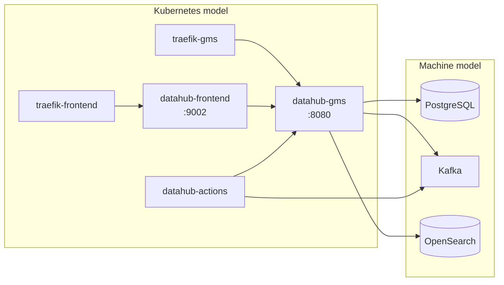

# Architecture

This page explains the components of a Charmed DataHub deployment, how they fit together, and the design decisions behind the charm.

## The DataHub workloads

The charm manages a single Kubernetes pod with three containers:

- **datahub-gms** - the Generalized Metadata Service, DataHub's backend. It stores and serves metadata, handles search queries, and exposes the REST and GraphQL APIs on port 8080.
- **datahub-frontend** - the web UI on port 9002. It authenticates users (local or SSO) and proxies their requests to the GMS.
- **datahub-actions** - the event processing framework. It consumes DataHub events from Kafka and runs asynchronous tasks, most notably executing the ingestion recipes scheduled through the UI or created by the charm.

## The backing services

DataHub keeps no state of its own; everything lives in three backing services, each provided by its own charm:

- **PostgreSQL** is the metadata store and the source of truth. Every metadata change is persisted here as a versioned aspect.
- **Kafka** is the event backbone. Metadata changes flow through Kafka topics (metadata change proposals and logs), which decouples writers from the components that react to changes.
- **OpenSearch** holds the search and graph indices, which are derived from the metadata store. They can be rebuilt from PostgreSQL at any time with the `reindex` action.

This topology is usually multi-cloud: the DataHub charm is a Kubernetes charm, while OpenSearch is only available as a machine charm. The relations therefore typically cross model boundaries through Juju offers, with a single controller hosting both clouds.

## Why two ingress endpoints

The frontend and the GMS serve different audiences. The frontend is a browser-facing single-page application; the GMS API is consumed by ingestion jobs, the DataHub CLI, and other services. Separating them into `frontend-ingress` and `gms-ingress` lets each get its own hostname, TLS configuration, and access policy - for example, a public UI hostname with SSO while the API stays internal.

The frontend SPA is compiled with absolute asset paths, which is why it must be served at the root of a hostname (host-based routing) rather than under a path prefix.

## Charm design

A few design decisions shape how the charm behaves in operation:

**Stateless charm, stateful backends.** The charm stores no credentials or state in peer relation data. Credentials live in Juju secrets - the user-supplied encryption keys and the charm-generated admin password, system client secret, and ingestion token - and are read from the secret store when needed. Any unit can look them up by deterministic label, so leader changes and pod restarts do not lose state.

**Reconciliation over event choreography.** Rather than reacting to each Juju event with bespoke logic, the charm converges the deployment toward the desired state on every relevant event: it renders service configuration from current relation data, updates Pebble layers, and reconciles external resources such as Trino ingestion sources. This makes behavior insensitive to event ordering, which matters especially for cross-model relations where data can arrive in a later event than expected.

**One-time bootstrap gated on backend state.** DataHub requires a one-time system update job (schema setup, index creation, policy bootstrap) before the GMS can serve authenticated traffic. The charm decides whether to run it by querying the backends for the markers the job itself writes - not by checking whether the workload is up. This works on a fresh deployment (job runs) and on a rebuilt pod with intact backends (job is skipped).

**Health checks sized for JVM cold starts.** Each container has a Pebble health check with automatic restart on failure. The failure threshold is deliberately generous (about five minutes at the 10-second check interval), long enough that a slow-but-healthy JVM cold start is not killed mid-boot, and short enough to rescue a genuinely hung start promptly.
