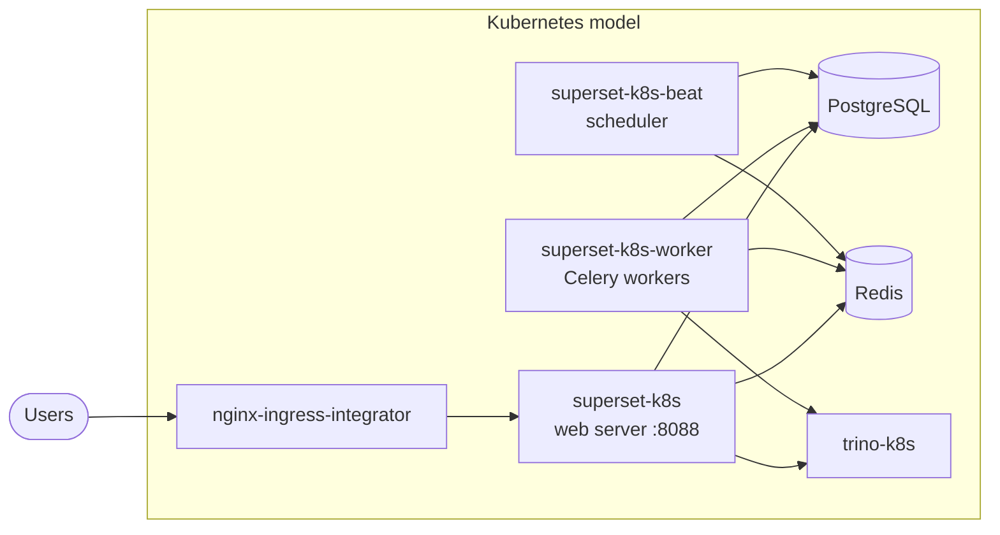

(explanation-superset-architecture)=

# Architecture

This page explains the components of a Superset deployment, how they fit together, and the design decisions behind the charm.

## One charm, three functions

Apache Superset is a single application that runs in three distinct roles. The charm keeps that shape: the same charm is deployed once per role, selected with the `charm-function` configuration option.

- **Web server and UI** (`app-gunicorn`) serves the browser interface and the REST API on port 8088. This is the only function that takes part in the ingress and Trino relations.
- **Worker** (`worker`) executes Celery tasks: asynchronous SQL Lab and chart queries, report and alert delivery, and cache warm-ups.
- **Beat scheduler** (`beat`) triggers periodic tasks on a schedule: report dispatch, cache warm-up, and pruning of the action log. Exactly one beat unit should run, otherwise scheduled tasks fire more than once.

Deploying them as separate Juju applications lets each scale on its own axis: the UI with concurrent users, workers with query and report volume, while beat stays singular.

## The backing services

- **PostgreSQL** holds all Superset state: users and roles, database connections, datasets, saved queries, chart and dashboard definitions, and the action log. All three functions share the same database, which is how a worker can decrypt a connection created in the UI.
- **Redis** plays two roles at once. It is the Celery broker that carries tasks from the UI and beat to the workers, and it is the cache for query results and asynchronous query events.
- **Trino**, in the Canonical Data Mesh, is where the data actually lives. Superset stores no analytical data of its own; it queries Trino, which federates the underlying sources.

## Charm design

**Configuration rendered into the Pebble layer.** The charm turns configuration options and relation data into environment variables on the workload service, and pushes the Superset configuration modules (`superset_config.py` and its siblings) into the container on every update. A configuration change therefore replans the service, which restarts the workload.
