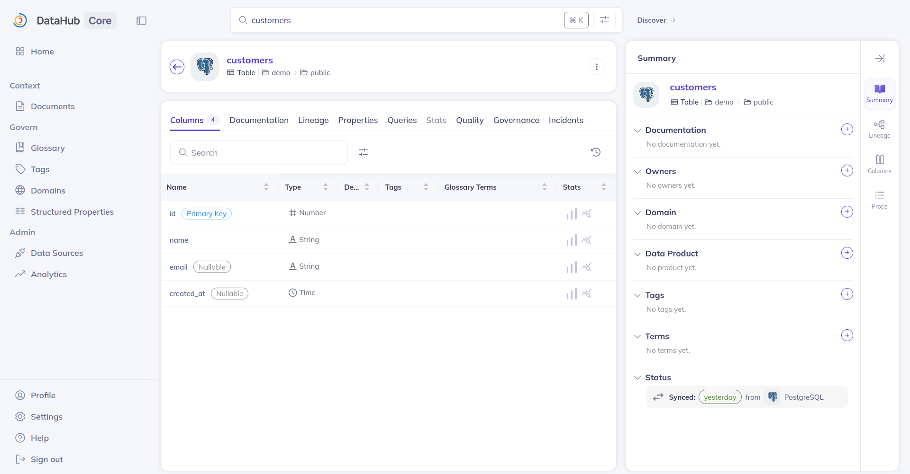

(tutorial-datahub-ingest-metadata)=

# Ingest metadata from a database

An empty catalog isn't much to look at. In this step you create a small PostgreSQL database with a demo table, then use DataHub's UI-based ingestion to pull its schema into the catalog.

## Create a demo database

The PostgreSQL application from the earlier steps can serve regular databases alongside DataHub's metadata store. Use the [Data Integrator](https://charmhub.io/data-integrator) charm to create a database and credentials for it.

Deploy it in the machine model and integrate it with PostgreSQL:

```bash
juju switch lxd:datahub-vm

juju deploy data-integrator --config database-name=demo
juju integrate data-integrator postgresql
```

Once both applications are active, retrieve the credentials:

```bash
juju run data-integrator/0 get-credentials
```

Note the `username`, `password`, and `endpoints` values from the `postgresql` section of the output.

## Add a demo table

Install the PostgreSQL client and create a table in the new database, replacing the placeholders with the values from the previous command:

```bash
sudo apt-get install -y postgresql-client

psql "postgresql://<USERNAME>:<PASSWORD>@<ENDPOINTS>/demo" -c "CREATE TABLE customers (id SERIAL PRIMARY KEY, name TEXT NOT NULL, email TEXT, created_at TIMESTAMP DEFAULT now());"
```

## Create an ingestion source in DataHub

Back in the DataHub UI:

1. Select **Ingestion** in the top navigation bar.
2. Click **Create new source** and choose **PostgreSQL**.
3. Fill in the connection details:
   - **Host and Port**: the `endpoints` value, for example `10.108.29.12:5432`
   - **Database**: `demo`
   - **Username** and **Password**: the credentials from the Data Integrator
4. Click **Next**, keep the default schedule settings, and give the source a name, for example `demo-postgres`.
5. Click **Save & Run**.

The ingestion run appears in the list with status **Pending**, then **Running**. After a minute or two it reports **Succeeded**.

```{note}
The ingestion runs inside the `datahub-actions` container, which must be able
to reach the database address. In this tutorial both clouds live on the same
host, so the Kubernetes pods can reach the LXD network directly.
```

## Explore the catalog

Type `customers` in the DataHub search bar. The table appears as a dataset with:

- The full column schema, types, and keys
- The `demo` database and schema hierarchy for browsing
- A place to add descriptions, owners, tags, and glossary terms



You have a working metadata catalog. The same flow applies to any PostgreSQL, and other connector types are available in the ingestion UI. For automatic, charm-managed ingestion of Trino catalogs, see {ref}`Integrate with Trino <how-to-datahub-integrate-with-trino>`.

Continue to {ref}`clean up <tutorial-datahub-cleanup>`.
