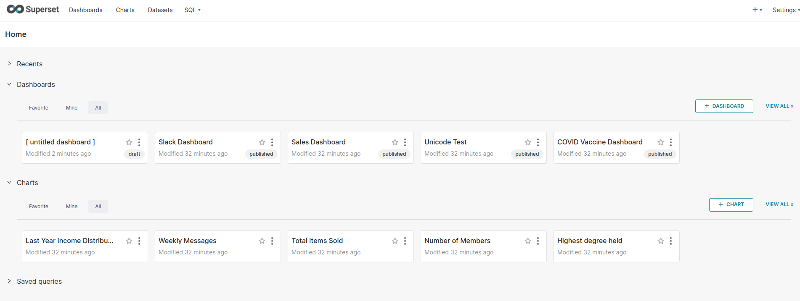
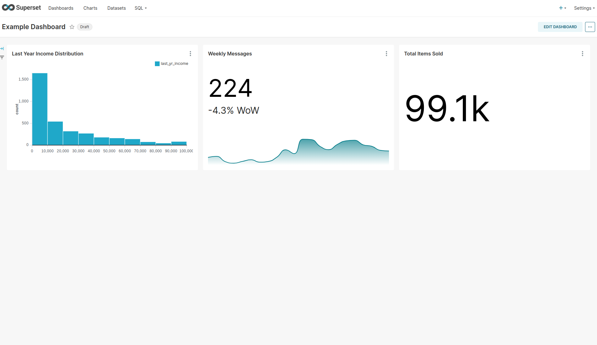

(tutorial-superset-create-a-dashboard)=

# Create a dashboard

A dashboard is a collection of charts, and every chart is built on a dataset. In this step you load Superset's example datasets and charts, then assemble a few of them into your first dashboard.

## Load the example data

The charm can load Superset's example datasets, charts, and dashboards for you:

```bash
juju config superset-k8s load-examples=True
```

The charm restarts the workload to load the data, which takes a few minutes. Wait until the unit is `active` again with the message `Status check: UP`:

```bash
juju status --watch 2s
```

```{note}
Keep this option enabled only for experimentation. Set it back to `False` once
you are done: the examples are re-imported on every workload restart, which
slows down startup.
```

## Explore the UI

Reload Superset in your browser. The home page now lists the example dashboards, charts, and saved queries:



The main sections are:

- **Dashboards**: collections of charts, with filters shared across them.
- **Charts**: individual visualizations, each bound to one dataset.
- **Datasets**: tables and saved queries exposed by a database connection.
- **SQL**: SQL Lab, where you write queries directly against a connected database.

## Build a dashboard

1. On the home page, select **+ Dashboard**. This opens a new draft dashboard.
2. Select **Edit dashboard**, then drag three of the example charts from the panel on the right onto the canvas.
3. Give the dashboard a name, for example `Example dashboard`.
4. Select **Save**.
5. Select the **Draft** label next to the title to publish the dashboard.



Your dashboard is now published and appears under **Dashboards** for every user with access to it.

## What to try next

The example data comes from Superset's built-in examples database. In a real deployment, you connect Superset to your own data instead, either by adding a database connection in the UI or, in the Canonical Data Mesh, by integrating Superset with Trino so that every Trino catalog becomes a Superset database connection automatically. See {ref}`Integrate with Trino <how-to-superset-integrate-with-trino>`.

When you are finished, continue to {ref}`clean up <tutorial-superset-cleanup>`.
